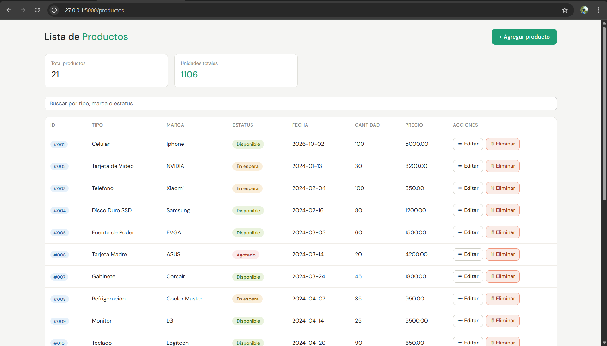
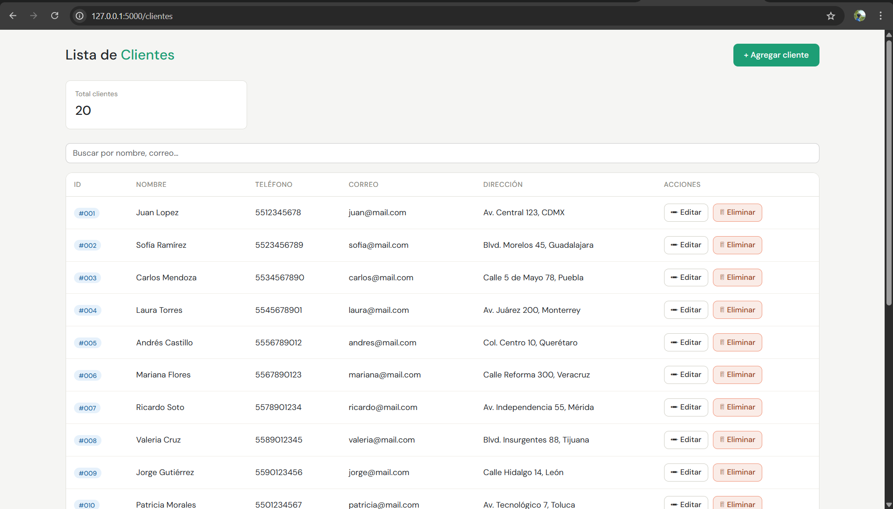

# 🖥️ Mini Sistema CRUD - Mayorista de Cómputo

Sistema web desarrollado con Flask y PostgreSQL para gestionar los datos de una empresa mayorista de cómputo.

## 🚀 Tecnologías usadas

- Python + Flask
- PostgreSQL
- HTML + Bootstrap 5
- psycopg2

## 📋 Funcionalidades

- CRUD completo de **Productos**
- CRUD completo de **Clientes**
- Búsqueda en tiempo real
- Interfaz responsive con Bootstrap

## ⚙️ Cómo ejecutarlo

1. Clona el repositorio
git clone https://github.com/Brandon-HB-10/mini-sistema-crud-frasco.git

2. Instala las dependencias
pip install flask psycopg2

3. Configura tu base de datos PostgreSQL en `aplicación.py`
4. Ejecuta el servidor
python aplicación.py

5. Abre tu navegador en `http://localhost:5000`

## 🗄️ Base de datos

El archivo `CRUD DE MAYORISTA DE COMPUTO.sql` contiene la estructura de la base de datos.

## 📁 Estructura del proyecto

├── aplicación.py
├── CRUD DE MAYORISTA DE COMPUTO.sql
└── plantillas/
├── productos.html
├── agregar.html
├── editar.html
├── clientes.html
├── agregar_cliente.html
└── editar_cliente.html

## 📸 Capturas

### Productos

### Clientes

---
Desarrollado por **Brandon-HB-10** · Ingeniería en TICs
